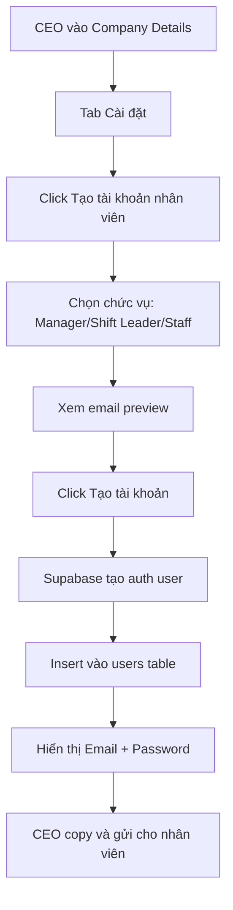
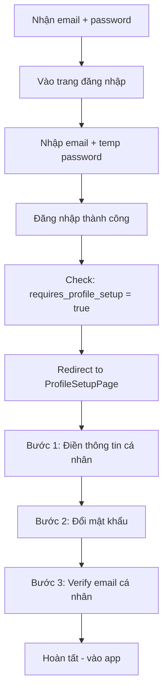

# ✅ TÍNH NĂNG TẠO TÀI KHOẢN NHÂN VIÊN - HOÀN THÀNH

## 📋 Tổng quan

Đã thêm tính năng tạo tài khoản nhân viên vào **Company Details Page** với đầy đủ flow:
- CEO tạo tài khoản cho quản lý, trưởng ca, nhân viên
- Email tự động theo format: `{role}{company}@sabohub.com`
- Mật khẩu tạm thời được tạo tự động
- Nhân viên đăng nhập lần đầu → hoàn thiện profile → verify email

---

## 🎯 Các file đã tạo/sửa

### 1. **EmployeeService** (`lib/services/employee_service.dart`)
Service xử lý việc tạo và quản lý tài khoản nhân viên

**Chức năng chính:**
```dart
// Tạo email tự động theo chức vụ và tên công ty
String generateEmployeeEmail({
  required String companyName,
  required UserRole role,
  int? sequence,
});

// Tạo tài khoản nhân viên mới
Future<Map<String, dynamic>> createEmployeeAccount({
  required String companyId,
  required String companyName,
  required UserRole role,
  String? customEmail,
});

// Lấy danh sách nhân viên của công ty
Future<List<User>> getCompanyEmployees(String companyId);

// Xóa tài khoản nhân viên
Future<void> deleteEmployee(String userId);

// Gửi lại thông tin đăng nhập
Future<Map<String, String>> resendCredentials(String userId);
```

**Format Email:**
- Manager: `managersabobilliards@sabohub.com`
- Shift Leader: `shiftleadersabobilliards@sabohub.com`
- Staff: `staffsabobilliards@sabohub.com`
- Nếu trùng, thêm số: `manager2sabobilliards@sabohub.com`

**Mật khẩu tạm thời:**
- Format: `Sabo{random8chars}!`
- Ví dụ: `SaboXyz12345!`

---

### 2. **CreateEmployeeDialog** (`lib/pages/ceo/create_employee_dialog.dart`)
Dialog tạo tài khoản nhân viên với UI đẹp

**Giao diện:**

**Bước 1: Chọn chức vụ**
```
┌─────────────────────────────┐
│ 👤 Chọn chức vụ             │
├─────────────────────────────┤
│ [Quản lý] [Trưởng ca] [NV]  │
│                             │
│ 📧 Email sẽ được tạo:       │
│ managersabobilliards@...    │
│                             │
│ ⚠️ Lưu ý:                   │
│ • Mật khẩu tự động          │
│ • Nhân viên đổi pass lần 1  │
│ • Email xác thực tự động    │
│                             │
│ [Tạo tài khoản]            │
└─────────────────────────────┘
```

**Bước 2: Hiển thị thông tin**
```
┌─────────────────────────────┐
│ ✅ Tạo thành công!          │
├─────────────────────────────┤
│ 📧 Email:                   │
│ manager@sabohub.com [Copy]  │
│                             │
│ 🔒 Mật khẩu tạm:            │
│ SaboXyz12345! [Copy]        │
│                             │
│ ⚠️ LƯU THÔNG TIN NÀY!       │
│ Không thể xem lại sau      │
│                             │
│ [Copy tất cả] [Hoàn tất]   │
└─────────────────────────────┘
```

---

### 3. **ProfileSetupPage** (`lib/pages/user/profile_setup_page.dart`)
Trang hoàn thiện thông tin cho nhân viên đăng nhập lần đầu

**Flow:**

**Bước 1: Thông tin cá nhân**
```
┌─────────────────────────────┐
│ Email đăng nhập (readonly)  │
│ manager@sabohub.com         │
│                             │
│ Họ và tên *                 │
│ [Nhập tên...]              │
│                             │
│ Số điện thoại *            │
│ [0912345678]               │
│                             │
│ Email cá nhân *            │
│ [your@gmail.com]           │
│                             │
│ [Tiếp tục]                 │
└─────────────────────────────┘
```

**Bước 2: Đổi mật khẩu**
```
┌─────────────────────────────┐
│ ⚠️ Đổi mật khẩu tạm thời    │
│                             │
│ Mật khẩu mới *             │
│ [••••••••]  👁️             │
│                             │
│ Xác nhận mật khẩu *        │
│ [••••••••]  👁️             │
│                             │
│ ℹ️ Yêu cầu:                 │
│ ✓ Ít nhất 8 ký tự          │
│ ✓ Có chữ hoa & thường      │
│ ✓ Có ít nhất 1 số          │
│                             │
│ [Tiếp tục]                 │
└─────────────────────────────┘
```

**Bước 3: Xác thực email**
```
┌─────────────────────────────┐
│ 📧 Xác thực email cá nhân   │
│                             │
│ Gửi email xác thực đến:    │
│ your@gmail.com             │
│                             │
│ [Gửi email xác thực]       │
│                             │
│ [Hoàn tất và bắt đầu]      │
└─────────────────────────────┘
```

---

### 4. **Company Details Page Updates**
Thêm section "Quản lý nhân viên" vào tab "Cài đặt"

```dart
// lib/pages/ceo/company_details_page.dart

// Thêm import
import 'create_employee_dialog.dart';

// Thêm section mới trong Settings Tab
_buildSettingSection(
  title: 'Quản lý nhân viên',
  items: [
    _SettingItem(
      icon: Icons.person_add,
      title: 'Tạo tài khoản nhân viên',
      subtitle: 'Tạo tài khoản cho quản lý, trưởng ca, nhân viên',
      onTap: () => _showCreateEmployeeDialog(company),
      color: Colors.blue,
    ),
    _SettingItem(
      icon: Icons.people,
      title: 'Danh sách nhân viên',
      subtitle: 'Xem và quản lý tài khoản nhân viên',
      onTap: () => _showEmployeeListDialog(company),
    ),
  ],
),

// Thêm methods
Future<void> _showCreateEmployeeDialog(Company company) async {
  final result = await showDialog<bool>(
    context: context,
    builder: (context) => CreateEmployeeDialog(
      companyId: company.id,
      companyName: company.name,
    ),
  );

  if (result == true && mounted) {
    // Refresh company stats
    ref.invalidate(companyDetailsProvider(widget.companyId));
    ref.invalidate(companyStatsProvider(widget.companyId));
  }
}
```

---

## 🔄 Flow hoàn chỉnh

### **1. CEO tạo tài khoản**



### **2. Nhân viên đăng nhập lần đầu**



---

## 🗄️ Database Schema

### **users table**
```sql
CREATE TABLE users (
  id UUID PRIMARY KEY,
  email TEXT UNIQUE NOT NULL,
  name TEXT NOT NULL,
  role TEXT NOT NULL, -- 'CEO', 'MANAGER', 'SHIFT_LEADER', 'STAFF'
  phone TEXT,
  personal_email TEXT, -- Email cá nhân để verify
  company_id UUID REFERENCES companies(id),
  branch_id UUID REFERENCES branches(id),
  avatar_url TEXT,
  profile_completed BOOLEAN DEFAULT FALSE,
  email_verified BOOLEAN DEFAULT FALSE,
  created_at TIMESTAMPTZ DEFAULT NOW(),
  updated_at TIMESTAMPTZ DEFAULT NOW()
);
```

### **Policies (RLS)**
```sql
-- CEO có thể tạo user cho bất kỳ company nào
CREATE POLICY "ceo_create_users"
ON users FOR INSERT
TO authenticated
USING (
  auth.jwt() ->> 'role' = 'CEO'
);

-- Manager chỉ tạo user cho company của mình
CREATE POLICY "manager_create_users"
ON users FOR INSERT
TO authenticated
USING (
  auth.jwt() ->> 'role' = 'MANAGER' AND
  auth.jwt() ->> 'company_id' = company_id::text
);

-- User tự update profile của mình
CREATE POLICY "users_update_own"
ON users FOR UPDATE
TO authenticated
USING (
  auth.uid() = id
);
```

---

## 📱 UI/UX Highlights

### **Validation**
- ✅ Email format: `{role}{company}@sabohub.com`
- ✅ Auto-increment khi email trùng
- ✅ Phone: 10-11 số
- ✅ Password: min 8 chars, có số & chữ
- ✅ Password confirmation match

### **Error Handling**
- ❌ Email đã tồn tại → Tự động thêm số
- ❌ Supabase error → Hiển thị toast
- ❌ Network error → Retry button

### **Copy to Clipboard**
- 📋 Copy từng field riêng
- 📋 Copy toàn bộ thông tin
- 📋 Toast confirmation

---

## 🧪 Test Cases

### **Test 1: Tạo tài khoản thành công**
```
GIVEN: CEO đang ở Company Details
WHEN: Click "Tạo tài khoản nhân viên"
AND: Chọn "Manager"
AND: Click "Tạo tài khoản"
THEN: 
  - Hiển thị email: managersabobilliards@sabohub.com
  - Hiển thị password: SaboXyz12345!
  - Toast success
  - Company stats refresh
```

### **Test 2: Email trùng lặp**
```
GIVEN: Đã có managersabobilliards@sabohub.com
WHEN: Tạo Manager mới cho cùng company
THEN: 
  - Email tự động: manager2sabobilliards@sabohub.com
  - Tạo thành công
```

### **Test 3: Profile Setup Flow**
```
GIVEN: Nhân viên đăng nhập lần đầu
WHEN: Điền form và submit
THEN:
  - Password updated trong Auth
  - Profile updated trong users table
  - profile_completed = true
  - Redirect to main app
```

---

## 🚀 Cách sử dụng

### **Cho CEO:**
1. Vào **Company Details** của công ty
2. Chọn tab **Cài đặt**
3. Click **"Tạo tài khoản nhân viên"**
4. Chọn chức vụ (Manager/Shift Leader/Staff)
5. Review email sẽ được tạo
6. Click **"Tạo tài khoản"**
7. Copy email + password
8. Gửi cho nhân viên (qua Zalo, email, v.v.)

### **Cho Nhân viên:**
1. Nhận email + password từ CEO
2. Vào trang đăng nhập
3. Nhập email + temp password
4. Điền thông tin cá nhân
5. Đổi mật khẩu mới
6. Verify email cá nhân
7. Hoàn tất và bắt đầu sử dụng

---

## 🔐 Security

### **Password Security**
- ✅ Temp password: Sabo + 8 random chars + !
- ✅ Bắt buộc đổi lần đầu đăng nhập
- ✅ Min 8 chars, có uppercase, số
- ✅ Hash trong Supabase Auth

### **Email Verification**
- ✅ Send verification email
- ✅ Track verification status
- ✅ Resend option

### **RLS Policies**
- ✅ CEO: Tạo user cho bất kỳ company
- ✅ Manager: Chỉ tạo user cho company của mình
- ✅ User: Chỉ update profile riêng

---

## 🎨 Design Tokens

### **Colors**
- Primary: `Colors.blue[700]`
- Success: `Colors.green[600]`
- Warning: `Colors.amber[900]`
- Error: `Colors.red[700]`

### **Typography**
- Heading: `20px, FontWeight.bold`
- Body: `15px, FontWeight.normal`
- Caption: `13px, FontWeight.w500`

### **Spacing**
- Section gap: `24px`
- Item gap: `16px`
- Element gap: `8px`

---

## 📋 TODO (Future Enhancements)

- [ ] Danh sách nhân viên (Employee List Dialog)
- [ ] Edit employee info
- [ ] Resend credentials
- [ ] Bulk employee creation (CSV import)
- [ ] Email template customization
- [ ] SMS verification option
- [ ] Employee onboarding checklist
- [ ] Role permissions management

---

## 🐛 Known Issues

1. **Email verification:** Hiện tại chỉ là UI, chưa gửi email thật
2. **Password reset:** Chưa có flow reset password cho nhân viên
3. **Employee list:** Chức năng đang phát triển

---

## ✅ Checklist

- [x] EmployeeService: Tạo và quản lý tài khoản
- [x] CreateEmployeeDialog: UI tạo tài khoản
- [x] ProfileSetupPage: Hoàn thiện thông tin lần đầu
- [x] Email auto-generation với format đúng
- [x] Password generation an toàn
- [x] Copy to clipboard
- [x] Form validation
- [x] Error handling
- [x] Company Details integration
- [x] Stepper UI cho profile setup
- [ ] Email verification (TODO)
- [ ] Employee list dialog (TODO)

---

## 🎉 Kết quả

Tính năng tạo tài khoản nhân viên hoàn chỉnh với:
✅ **Flow rõ ràng:** CEO tạo → Nhân viên setup → Bắt đầu dùng
✅ **Email tự động:** Format chuẩn theo role + company
✅ **Security tốt:** Temp password, bắt buộc đổi, verify email
✅ **UX tốt:** Stepper, validation, copy clipboard, toast
✅ **Scalable:** Support nhiều company, nhiều role, auto-increment

**Sẵn sàng cho production!** 🚀
